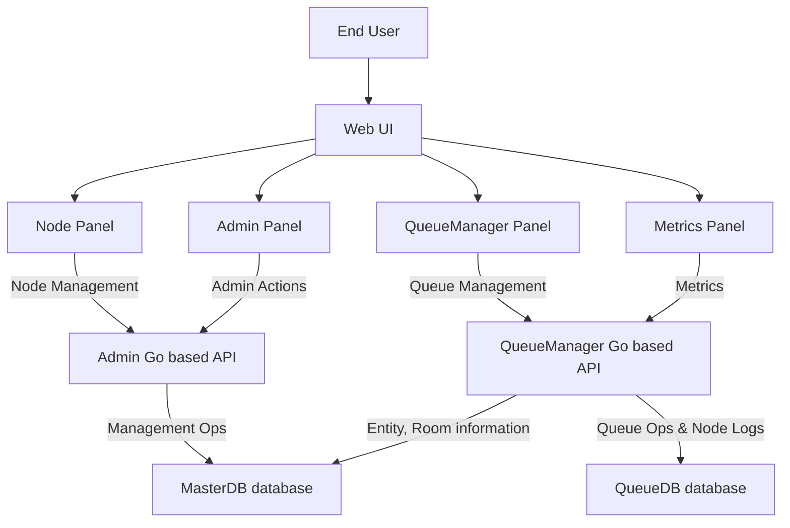

# Queue Manager 

Queue Manager is a system for managing and simulating resource queues. It consists of a Go-based backend that exposes APIs for managing nodes, resources, and their allocation, as well as a web-based UI for visualizing the queue state, interacting with nodes and resources, and running simulations or tests of the queue management logic.



**Architecture diagram:**  
- The end user interacts with the Web UI and Admin Panel.
- The Web UI communicates with both the main API (resource management) and Master API (advanced operations).
- Both APIs interact directly with the database to store queue state, resources, nodes, and metrics.
- Real-time/statistics updates are provided to the UI.
- The Admin Panel allows privileged operations by sending admin actions to the API.


## UI Features

- **Visual Resource Boxes**: Each resource is displayed as a box showing:
  - Resource ID and current capacity usage
  - Service Queue (nodes currently consuming capacity)
  - Waiting Queue (nodes assigned but waiting for capacity)

- **Node Management**:
  - Create new nodes with optional immediate assignment to a resource
  - Create nodes from an **Entity** (managed via the Admin page)
  - Move nodes between resources
  - Allocate nodes from waiting queue to service queue (respects capacity limits)
  - Complete nodes (removes them from resources)

- **Node Timers / Metrics**:
  - Shows total time in system per node (from creation until completion)
  - Shows time spent waiting per resource (a node can visit the same resource multiple times; each visit is tracked)
  - Shows **resource session metrics** (aggregate waiting/service metrics per resource)
  - Metrics panel refreshes every 10 seconds

- **Real-time Updates**: The UI automatically refreshes every 2 seconds to show the latest state

- **Multi-page UI**:
  - `/` - Main queue visualization
  - `/node` - Node creation
  - `/metrics` - Metrics dashboard
  - `/admin` - Admin (Users, Entities, Rooms)

## Usage 

- Web UI: `http://localhost:3000`
- API: `http://localhost:8080`
- Master API: `http://localhost:8081`


### Using Docker in production 

```bash
docker compose up --build 
```

### Development (hot reload)

```bash
docker compose -f docker-compose.dev.yml up --build
```

### For manual running

- Ensure Postgres is running (provides `nodequeue` + `master_db`; easiest via `docker compose up db`)

1. **Start the backend service**:
   ```bash
   cd queue-service
   go run .
   ```
   The service will start on `http://localhost:8080`

2. **Start the master service (Admin DB / Entities / Users / Rooms)**:
   ```bash
   cd queue-admin
   go run .
   ```
   The service will start on `http://localhost:8081`

3. **Use the Next.js UI (recommended)**:
   ```bash
   cd queue-ui
   # Create a local env file based on env.example:
   cp env.example .env.local
   npm install
   npm run dev
   ```
   Then open `http://localhost:3000`.


## UI Controls

### Create Node
- Enter a node name in the input field
- (Recommended) Pick an existing **Entity** (create/search Entities via `/admin`)
- Optionally select a resource to add the node to immediately
- Click "Create Node" button

### Node Actions
Each node displays action buttons based on its state:

- **Allocate**: Available for nodes in the waiting queue. Moves the node to the service queue if capacity allows.
- **Move**: Available for nodes assigned to a resource. Moves the node to a different resource.
- **Add to Resource**: Available for unassigned nodes. Adds the node to a resource's waiting queue.
- **Complete**: Marks the node as completed and removes it from its resource.

## Visual Indicators

- **Service Queue**: Green dashed border - nodes currently consuming resource capacity
- **Waiting Queue**: Orange dashed border - nodes waiting for available capacity
- **Completed Nodes**: Grayed out and cannot be moved or allocated
- **Capacity Display**: Shows current usage vs. total capacity (e.g., "3 / 5")

## API Integration

The UI uses the following API endpoints:
- `GET /resources` - List all resources
- `GET /nodes` - List all nodes
- `GET /nodes/metrics` - List all node metrics (total time in system + per-resource waiting time)
- `GET /resources/metrics` - List resource session metrics (aggregate waiting/service stats)
- `POST /nodes` - Create a new node (with optional `resource_id`)
- `POST /nodes/{id}/move` - Move a node to another resource
- `POST /nodes/{id}/allocate` - Allocate a waiting node to service queue
- `POST /nodes/{id}/complete` - Complete a node

- Master service endpoints (used by `/admin`):
  - `GET /entities`, `POST /entities`
  - `GET /users`, `POST /users`
  - `GET /rooms`, `POST /rooms`

All endpoints support CORS for cross-origin requests.
