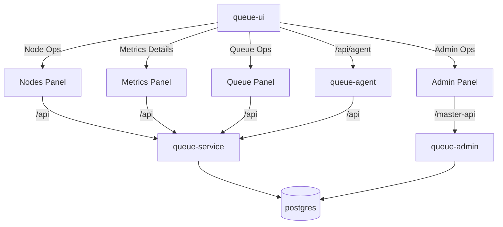

# Queue Manager

Queue Manager is a multi-service system for managing and simulating **resource queues** (nodes moving through resources with capacity). It includes a Next.js UI, Go services for queue operations + admin, and an “agent” service that answers natural-language questions about metrics.



## Services (default ports)

- **`queue-ui`**: `http://localhost:3000` (Next.js UI)
- **`queue-service`**: `http://localhost:8080` (queue + metrics APIs)
- **`queue-admin`**: `http://localhost:8081` (users/entities/rooms + auth)
- **`queue-agent`**: `http://localhost:8090` (HTTP JSON-RPC “agent” over metrics)
- **Postgres**: `localhost:5432` (nodequeue + master_db)


## UI pages (routing)

- **`/` (Landing)**: quick links into the app (public).
- **`/rooms/waiting` (Public)**: live waiting rooms view (no login).
- **`/agent` (Public)**: interactive agent chat over metrics (no login).
- **`/login`**: login page.
- **`/queue` (Login required)**: allocate/move/complete nodes across resources.
- **`/node` (Login required)**: node creation + node interactions.
- **`/metrics` (Login required)**: metrics dashboards.
- **`/admin` (Login + Admin required)**: manage users, entities, rooms.

## Auth and roles

- **Login**: UI uses a signed cookie session (`AUTH_SECRET`) and exposes auth routes under `queue-ui/src/app/api/auth/*`.
- **Normal user**: can access non-admin authenticated pages (e.g. nodes/queue/metrics).
- **Admin user**: can access `/admin` in addition to normal user pages.
- **Agent**: `/agent` is intentionally **public** (no session required).

## Metrics provided

From `queue-service`:
- **Node metrics** (`GET /nodes/metrics`): active + completed nodes, including total time in system and per-resource waiting segments.
- **Resource session metrics** (`GET /resources/metrics`): per-resource aggregates (queue sizes, totals, averages for waiting/service time).

From `queue-agent` (built on those metrics):
- English summaries + cached context
- Q&A support such as:
  - “Which resources still have nodes?”
  - “Node details for 1234 / <node-id>”
  - “How long has node 1234 been in resource <name>?”

## API reference (by service)

### queue-service (port 8080)

- `GET /resources` — list resources
- `GET /nodes` — list nodes
- `POST /nodes` — create node (optionally assign to `resource_id`)
- `POST /nodes/{id}/move` — move node to another resource
- `POST /nodes/{id}/allocate` — allocate waiting node into service queue
- `POST /nodes/{id}/complete` — complete node
- `GET /nodes/metrics` — node metrics (active/completed + waiting segments)
- `GET /resources/metrics` — per-resource session metrics

### queue-admin (port 8081)

- `GET /entities`, `POST /entities`
- `GET /users`, `POST /users`
- `GET /rooms`, `POST /rooms`

### queue-agent (port 8090)

- `GET /healthz` — health check
- `POST /rpc` — JSON-RPC 2.0 endpoint supporting:
  - `initialize`
  - `tools/list`
  - `tools/call` for `queue_nodes_metrics`, `queue_resources_metrics`, `queue_metrics_question`

### queue-ui (port 3000)

- UI pages under `/` (see “UI pages” above)
- Auth routes under `/api/auth/*` (login/logout/me)
- Agent proxy route: `POST /api/agent` with:
  - `{ \"action\": \"refresh\" }`
  - `{ \"action\": \"query\", \"question\": \"...\" }`

## Usage

### Docker (recommended)

Production-like:

```bash
docker compose up --build
```

Development (hot reload):

```bash
docker compose -f docker-compose.dev.yml up --build
```

### Manual running (local)

- Ensure Postgres is running (provides `nodequeue` + `master_db`; easiest via `docker compose up db`)

1. Start `queue-service`:

```bash
cd queue-service
go run .
```

2. Start `queue-admin`:

```bash
cd queue-admin
go run .
```

3. Start `queue-agent` (HTTP):

```bash
cd queue-agent
QUEUE_SERVICE_BASE_URL=http://localhost:8080 QUEUE_AGENT_HTTP_ADDR=:8090 go run .
```

4. Start `queue-ui`:

```bash
cd queue-ui
cp env.example .env.local
npm install
npm run dev
```

Open `http://localhost:3000`.
